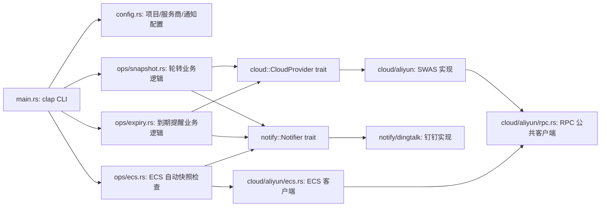

# ops-console

服务商运维系统：多服务商统一运维操作 CLI（Rust）。

起步实现：**阿里云轻量应用服务器（SWAS）快照轮转**。通过服务商抽象层，后续可平滑接入腾讯云、AWS 等。

## 功能

- 多项目 × 多服务商配置（`config/project.yml`），一条命令遍历全部项目/服务商
- 阿里云轻量服务器快照轮转：删旧建新，保留指定份数，自动等待就绪
- 服务器到期提醒：命中 30/15/3 天阈值（可配置）或已过期时通知（SWAS + ECS）
- ECS 自动快照策略检查：巡检实例磁盘是否绑定了自动快照策略，随 `snapshot` 一起执行，未开启的汇总通知
- 磁盘占用检查：SWAS（DescribeMonitorData）+ ECS（云监控 diskusage_utilization）使用率超阈值（默认 90%，--threshold 可配）或数据缺失时通知
- 通知渠道抽象：钉钉机器人（加签 + 标题签名），可替换扩展
- 凭据支持配置文件与环境变量双重注入（推荐环境变量，适配 CI / systemd / cron）

## 快速开始

```bash
# 构建
cargo build --release

# 准备配置（从示例复制后填写）
cp config/project.yml.example config/project.yml
cp config/notify.yml.example config/notify.yml   # 可选，不需要通知可省略

# 查看项目
./target/release/ops-console projects

# 快照轮转（保留 2 份）：全部项目 × 全部服务商 × 全部实例
./target/release/ops-console snapshot --keep 2

# 指定项目 / 指定服务商
./target/release/ops-console --project demo snapshot --keep 2
./target/release/ops-console --provider aliyun snapshot --keep 2

# 服务器到期提醒（默认 30/15/3 天阈值，可 --days 自定义）
./target/release/ops-console expiry
./target/release/ops-console expiry --days 60,30,7

# 磁盘占用检查（默认阈值 90%，可 --threshold 调整）
./target/release/ops-console disk
./target/release/ops-console disk --threshold 85

# ECS 检查随 snapshot / expiry 一起执行，无需单独命令：
#   snapshot  → 轮转 + ECS 自动快照策略检查
#   expiry    → SWAS + ECS 到期提醒
```

## 配置

### project.yml（项目与服务商）

YAML 文档根即项目数组，每个项目下 `providers.<kind>` 配置服务商，`key` 即服务商类型（`aliyun` / 未来的 `tencent` / `aws` ...）。

```yaml
- name: demo
  description: 示例项目
  providers:
    aliyun:
      region: cn-shenzhen
      access_key_id: ""        # 留空则用环境变量
      access_key_secret: ""

- name: prod
  providers:
    aliyun:
      region: cn-hangzhou
      access_key_id: ""
      access_key_secret: ""
```

### notify.yml（通知渠道，可选）

不存在此文件 = 不通知。

```yaml
kind: dingtalk
prefix: "【通知】"        # 标题签名，标记消息来源；空 = 不加

dingtalk:
  webhook: ""              # 留空则用环境变量 DINGTALK_WEBHOOK_URL
  secret: ""               # 加签密钥，留空则用环境变量 DINGTALK_SECRET
```

### 环境变量

| 变量 | 作用 |
|---|---|
| `ALIYUN_ACCESS_KEY_ID` / `ALIYUN_ACCESS_KEY_SECRET` | 覆盖所有项目的阿里云凭据 |
| `DINGTALK_WEBHOOK_URL` / `DINGTALK_SECRET` | 覆盖钉钉通知 webhook / 加签密钥 |

## 命令参考

```text
ops-console [--config <目录>] [--project <名>] [--provider <kind>] snapshot [选项]

全局参数:
  --config <目录>    配置目录（含 project.yml / notify.yml），默认 config/
  --project <名>     目标项目，默认全部项目
  --provider <kind>  只执行指定服务商（如 aliyun），默认项目内全部服务商
  --log <级别>       error|warn|info|debug，默认 info

子命令:
  projects                   列出所有项目
  snapshot [--keep 2] [--wait-minutes 30]
                             快照轮转：遍历目标项目 × 服务商 × 全部实例，删旧建新；
                             随后检查 ECS 自动快照策略（未开启的实例汇总通知）
                             单项目/服务商/实例失败不阻断其余，最后汇总报错并退出非零
  expiry [--days 30,15,3]
                             到期提醒：检查 SWAS + ECS 全部实例到期时间，命中阈值
                             （或已过期）时输出并汇总发一条通知；无命中则不通知
  disk [--threshold 90]
                             磁盘占用检查：SWAS + ECS 全部 Running 实例，
                             使用率达到阈值或数据缺失时输出并汇总发一条通知
                             （数据缺失 = Running 但查不到监控数据，疑似未装云监控插件）
```

## 快照轮转策略

1. 校验 `keep >= 1`；按创建时间排序
2. 删除多余的旧快照，保留最新 `keep-1` 份（新建 1 份后合计 `keep` 份）；删除失败仅告警不中断
3. 存在创建中的快照则轮询等待（30s 间隔，超时上限 `--wait-minutes`），避免超过单台上限
4. 清理 Failed 快照（占名额且无用）
5. 创建新快照（命名 `{服务器名}-{北京时间 YYYYMMDD-HHMMSS}`），等待变为可用
6. 输出摘要，并发送到通知渠道（发送失败仅告警，不影响退出码）

> 阿里云轻量限制：单台最多 3 个快照。`keep=2` 时轮转窗口 = 2 旧 + 1 新建中。

## ECS 检查说明

- 复用 `project.yml` 中 `aliyun` 配置的凭据与地域（ECS 与轻量同账号，无需新增配置）
- 自动快照检查随 `snapshot` 执行：`DescribeDisks` 返回每块云盘的 `AutoSnapshotPolicyId`，实例任一磁盘绑定了策略即视为已开启；同时展示策略详情（触发时间 / 周期 / 保留天数）
- 到期检查随 `expiry` 执行：到期时间来自 `DescribeInstances` 的 `ExpiredTime`，与 SWAS 同一套阈值逻辑，汇总渲染时以 `aliyun-ecs` 标记区分

## 阿里云 RAM 权限

轻量（SWAS）最小权限策略（注意 Action 前缀是 `swas-open:` 而非 `swas:`）：

```json
{
  "Version": "1",
  "Statement": [
    {
      "Effect": "Allow",
      "Action": [
        "swas-open:ListInstances",
        "swas-open:ListDisks",
        "swas-open:ListSnapshots",
        "swas-open:CreateSnapshot",
        "swas-open:DeleteSnapshot",
        "swas-open:DescribeMonitorData"
      ],
      "Resource": "*"
    }
  ]
}
```

ECS 只读检查最小权限策略：

```json
{
  "Version": "1",
  "Statement": [
    {
      "Effect": "Allow",
      "Action": [
        "ecs:DescribeInstances",
        "ecs:DescribeDisks",
        "ecs:DescribeAutoSnapshotPolicyEx",
        "cms:QueryMetricLast"
      ],
      "Resource": "*"
    }
  ]
}
```

## 到期提醒策略

1. 读取实例到期时间（阿里云 `ListInstances` 返回的 `ExpiredTime`，无需额外 API）
2. 剩余天数向上取整；**精确命中**阈值（默认 30/15/3 天）或已过期（<= 0 天）时提醒
3. 每天 cron 跑一次时，精确命中只有一天，天然不重复提醒；已过期则每次运行都提醒（紧急）
4. 全部命中项汇总为**一条**通知发送（避免刷屏）；无命中不通知
5. 按量付费等无到期时间的实例自动跳过

## cron 示例

```bash
# 每日 03:00 轮转全部项目，钉钉通知（凭据走环境变量，不经文件）
0 3 * * * DINGTALK_WEBHOOK_URL=... DINGTALK_SECRET=... \
  /opt/ops-console/target/release/ops-console \
  --config /opt/ops-console/config \
  snapshot --keep 2 >> /var/log/ops-console.log 2>&1

# 每日 09:00 检查服务器到期（30/15/3 天阈值），命中才通知
0 9 * * * DINGTALK_WEBHOOK_URL=... DINGTALK_SECRET=... \
  /opt/ops-console/target/release/ops-console \
  --config /opt/ops-console/config \
  expiry >> /var/log/ops-console.log 2>&1

# 每 6 小时检查一次磁盘占用（默认阈值 90%）
0 */6 * * * DINGTALK_WEBHOOK_URL=... DINGTALK_SECRET=... \
  /opt/ops-console/target/release/ops-console \
  --config /opt/ops-console/config \
  disk >> /var/log/ops-console.log 2>&1
```

## 架构



- **服务商抽象**：`cloud::CloudProvider` 定义统一的 `Server` / `Snapshot` 模型，轮转逻辑只依赖 trait。接入新服务商 = 实现 trait + 一个 API 模块（参考 `cloud::aliyun`）。
- **RPC 客户端复用**：`cloud/aliyun/rpc.rs` 封装签名 + HTTP + 分页 + 统一错误处理，SWAS 与 ECS 共用；换 `product` 前缀 + API Version 即可接入新产品。
- **通知抽象**：`notify::Notifier` 统一 `send(title, text)`。接入 Slack / Telegram 等 = 实现 trait + 在 `notify::from_config` 加一个分支。
- **签名复用**：`cloud/aliyun/sign.rs` 是通用阿里云 RPC V3 签名（HMAC-SHA1），SWAS / ECS / SLB / DNS 等任意 RPC 风格产品换 endpoint + Version + Action 即可复用。

## 发布（Release）

推送 `v*` tag 即触发 GitHub Actions 自动发布：

```bash
git tag v0.1.0 && git push origin v0.1.0
```

- 在 `ubuntu-latest` 上用 `x86_64-unknown-linux-musl` 交叉编译**静态 Linux 二进制**（不依赖 glibc，任意发行版可直接运行）
- 产物：`ops-console-<版本>-linux-x86_64.tar.gz`，随 GitHub Release 发布
- Release Notes 由 `generate_release_notes` 自动生成（基于 commit）

## 开发

```bash
cargo check     # 编译检查
cargo test      # 单元测试（签名向量、通知消息体）
```
